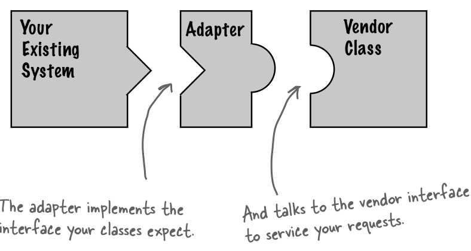

# C7 - The Adapter and Facade Patterns

Gerçek dünyadaki adaptörler gibi, farklı parçaların birbiriyle uyumlu çalışması için koyulan parçalardır:



Bölüm 1'deki ördek benzetmemizi yine burada kullanırsak; 

```java
public interface Duck{
    public void quack();
    public void fly();
}
```

Hindi gibi yeni bir tür ekleyeceğiz:



```java
public interface Turkey{
    public void gobble();
    public void fly();
}
```



```java
public class WildTurkey implements Turkey{
    public void gobble(){
        System.out.println("Gobble gobble.");
    }
    
    public void fly(){
        System.out.println("I'm flying a short distance.");
    }
}
```



Şimdi diyelim ki ördek nesneleri kullanamıyoruz, onun yerine hindi nesnesi kullanacağız. Ancak açıkça kullanamayız çünkü farklı interface'lere sahipler. Bu yüzden bir adapter yazalım:



```java
public class TurkeyAdapter implements Duck{
    Turkey turkey;
    
    public TurkeyAdapter(Turkey turkey){
        this.turkey = turkey;
    }
    
    public void quack(){
        turkey.gobble();
    }
    
    public void fly(){
        // Ördek gibi, daha uzun uçabilmesi için 5 defa çağırdık :)
        for(int i = 0; i < 5; i++){
            turkey.fly();
        }
    }
}
```



```java
public class Demo{
    public static void main(String[] args){
        MallardDuck mallardDuck = new MallardDuck();
        
        WildTurkey wildTurkey = new WildTurkey();
        Duck turkeyAdapter = new TurkeyAdapter(wildTurkey);
        
        System.out.println("The turkey says..");
        turkey.gobble();
        turkey.fly();
        
        System.out.println("The duck says..");
        mallardDuck.quack();
        mallardDuck.fly();
        
        System.out.println("Adapted turkey says..");
        turkeyAdapter.quack();
        turkeyAdapter.fly();
    }
}
```



Özetleyecek olursak, bize hedef interface olan Duck lazım. Ancak bizde Duck interface'ine adapte edilmesi gereken Turkey interface'i var. Bu çeviriyi / adaptasyonu yapmak için bir adaptör sınıf yazıyoruz. Ve istemci, sadece yapılan çağrının sonucunu alıyor ve çeviri yapan bir adaptörün varlığından haberi olmuyor.

**Soru:** Bir adaptörün ne kadar "adapte" etmesi gerekiyor? Eğer büyük bir interface'i adapte etmem gerekirse, yapılacak çok FAZLA! iş olacak gibi gözüküyor.

**Cevap:** Evet. Bir adaptörün yazımında yapılacak iş, çeviri yapılacak hedef interface'in büyüklüğü ile orantılı oluyor. Ancak seçeneklerimizi düşünürsek, ya interface'e yapılan bütün istemci çağrılarını incelememiz ve detaylı çalışmamız gerekecek, ya da tüm değişiklikleri temiz bir şekilde belirten tek bir adaptör sınıfı yazacağız.

**Soru:** Bir adaptör her zaman sadece bir sınıfı mı sarmalar?

**Cevap:** Adaptör deseninin amacı bir interface'i diğerine tercüme etmektir. Çoğu örnek adaptörlerin tek bir sınıfı adapte ettiğini gösterse de, gerçek dünyanın çok daha karmaşık olduğunu biliyoruz. Yani, adaptörün birden fazla sınıfı sarmaladığı, çeviri yaptığı durumlar olabilir. Ancak bu, "Facade" isimli desenle karıştırılmamalıdır.

**Soru:** Diyelim ki sistemimin eski ve yeni parçaları var. Eski kısmı eski interface'i beklerken, biz halihazırda yeni interface'i kullanmak için yeni kısımları yazdık. Bir yanda eski kısımda adaptör kullanırken, diğer yanda yeni kısımda sarmalanmamış interface kullanmak kafa karıştırıcı olacak. Adaptörü boş verip eski koda dönsem daha iyi değil mi?

**Cevap:** Şart değil. Burada iki interface'i de destekleyen iki yönlü adaptör yazabilirsin. Bu adaptör iki interface'i de implement edecek ve aynı anda ikisi gibi davranacak.

**Adapter Pattern;** bir interface'i istemcinin istediği interface'e dönüştürür. Adaptör, uyumsuz interface'ler nedeniyle birbiriyle çalışamayan sınıfların ortak çalışmasına izin verir.


### Object and Class Adapters

Aslında iki tür adaptör deseni bulunuyor: Sınıf ve nesne adaptörleri. Yukarıda gösterilen adaptör türü nesne adaptörü. Sınıf adaptöründen bahsetmememizin sebebi, onu uygulamak için Java'da mümkün olmayan çoklu kalıtım gerekmesi. Yine de çoklu kalıtımı destekleyen başka bir dilde karşınıza çıkması ihtimaline karşın sınıf diyagramını paylaşıyoruz: 


* Nesne adaptörü, kompozisyonu kullanmakta ve sadece adapte ettiği sınıfı değil onun alt sınıflarını da adapte edebilir. Bunun yanında sınıf adaptörü tek bir spesifik sınıfı adapte ettiği için bunu yapamaz ancak onun büyük avantajı tüm sınıfı adapte etmesi gerekmez. Miras aldığı için sadece gerektiğinde istediği override ederek adapte edebilir.

### Gerçek Dünyada Adaptörler

* **Enumaration:** Java'da daha eski olan; collection tiplerinin\(Vector, Stack, Hashtable\) elements\(\) şeklinde bir metodu var ve bir Enumaration döndürüyor. Bu interface, nasıl yönetildiğini bilmediğimiz bir koleksiyondaki elementlerde dolaşma imkanı sunuyor.
* **Iterator:** Yeni Collection sınıflarıyla birlikte gelen bu interface, Enumaration'a ek olarak elementleri koleksiyondan çıkarma yeteneğini ekledi.

Daha eski olan kodlarda Enumaration görürken, yeni kodlarda Iterator interface'ini görüyoruz. Bu yüzden bir adaptör yazmamız gerekebilir. Öncelikle adaptörü tasarlayabilmek için adapte edilecek ve hedef sınıfları incelememiz gerekiyor ki, interface yeteneklerini tercüme edebilelim:


hasNext\(\) metodunu hasMoreElements\(\), next\(\) metodunu nextElement\(\) ile eşleştiğini görüyoruz. Ancak biliyoruz ki, Enumaration sadece read-only\(okuma izinli\) bir interface ve element çıkarmayı desteklemiyor. Bu yüzden adaptörümüze işlevsel bir remove\(\) metodu ekleyemeyeceğiz. Yapabileceğimiz en iyi şey ise bir Runtime Exception fırlatmak. Şanslıyız ki, Iterator sınıfını tasarlayanlar bu ihtiyacı görmüşler ve remove\(\) metodunu "UnsupportedOperationException" destekleyecek şekilde yazmışlar. Bu şekilde adaptörümüz mükemmel değil, ancak istemci potansiyel exception'lar için dikkatli olursa ve dokümantasyon iyi yapılırsa makul bir çözüm diyebiliriz:

```java
public class EnumarationIterator implements Iterator{
    Enumaration enumeration;
    
    public EnumarationIterator(Enumaration enumeration){
        this.enumeration = enumeration;
    }
    
    public boolean hasNext(){
        return enumeration.hasMoreElements();
    }
    
    public Object next(){
        return enumeration.nextElement();
    }
    
    public void remove(){
        throw new UnsupportedOperationException("This operation is "
        + "not supported for Enumeration interface.");
    }
}
```

### Decorator Vs. Adapter Vs. Facade

* **Decorator:** Interface'i değiştirmeksizin, yeni sorumluluk/davranış ekler.
* **Adapter:** Bir interface'i diğerine çevirir.
* **Facade:** Bir interface'i basitleştirir.

Facade desenini inceleyeceğimiz örneğimize geçelim: Ev sineması kurmak istiyoruz ve birçok sistemi bir araya getirmek gerekiyor:


Bu sistemde, bir film izlemek için bir dizi eylem gerekiyor:

```java
// Mısır patlat.
popper.on();
popper.pop();
// Işığı azalt.
lights.dim(10);
// Ekranı indir.
screen.down();
// Projektörü ayarla.
projector.on();
projector.setInput(dvd);
projector.wideScreenMode();
// Amfiyi ayarla.
amp.on();
amp.setDvd(dvd);
amp.setSurroundSound();
amp.setVolume(5);
// Dvd oynatıcıyı ayarla.
dvd.on();
dvd.play(movie);
```

Çok fazla işlem gözüküyor. Dahası, film bittiğinde bu eylemleri tersten tekrar etmek veya sisteme yeni bir parça eklediğimizde yine farklı bir prosedürü takip etmemiz gerekiyor. Bu da karmaşık bir yapıyı ortaya çıkarıyor. 

Bu noktada yardımımıza **Facade** deseni koşuyor. Facade, karışık bir sistemi alıp, daha kolay kullanmanızı sağlayan bir veya daha fazla mantıklı arayüz sınıfı sunuyor:


Bu şekilde istemci, Facade sınıfı üzerinden daha basit metod çağrıları yapabilir. Film izlemek için tek bir metod çağırıyoruz. Facade, alt sisteme\(Dvd oynatıcı vs.\) erişimi kısıtlamıyor, daha detaylı erişime ihtiyacınız olursa kullanıma açık bırakıyor.

**Soru:** Eğer Facade, alt sistemleri kapsüllüyorsa alt seviye bir işleve ihtiyaç duyan istemci nasıl erişim sağlıyor?

**Cevap:** Facade, alt sistemleri kapsüllemiyor, sadece daha basit bir arayüz sunuyor. Eğer istemci daha karmaşık daha detaylı özelliklere erişmek isterse hala alt sistemlere direkt olarak erişebilir.

**Soru:** Facade yeni bir davranış ekliyor mu yoksa sadece alt sistemlere isteği mi iletiyor?

**Cevap:** Bir facade, alt sistemleri daha iyi kullanabilmek için kendi "akıllı" davranışlarını eklemekte özgürdür. Örneğimizde yeni bir davranış eklememiş olsak da, mısır patlatıcısının mısır patlatmadan önce onu açması gerektiğinin farkında.

**Soru:** Bir sistemde sadece bir facade mi bulunması gerekir?

**Cevap:** Şart değil. Desen istenilen sayıda facade yaratmaya izin veriyor.

**Soru:** Daha basit bir arayüz sağlamasının dışında Facade deseninin faydası nedir?

**Cevap:** Desen aynı zamanda istemci kodu ile alt sistem kodunu ayrıştırıyor. Diyelim ki ev sistemini genişleteceğiz, yeni alt sistemler ekleyeceğiz. Eğer istemci kodunu, alt sistem yerine bir Facade'e yazdıysan, istemci kodda değişiklik yapmana gerek yok, sadece Facade değişecek.

**Soru:** Adaptör deseni ile farkı nedir? Adaptör tek bir sınıfı sarmalarken, Facade birden çok sınıfı mı sarmalıyor?

**Cevap:** Hayır! Çoğu örnek adaptör deseninin tek bir sınıfı sarmaladığını gösterse de daha fazla da sarmalayabilir. Aynı şekilde Facade çok karmaşık olan tek bir alt sistem sınıfını sarmalayabilir. Fark sarmalanan sınıf sayısında değil, amaçtadır. Adaptör, bir sınıfı sarmalar ki, istemcinin ihtiyacı olan tiple eşleşsin. Facade ise, alt sistem için daha basit bir arayüz sağlamayı amaçlar.



```java
public class HomeTheaterFacade{
    Amplifier amp;
    Tuner tuner;
    DvdPlayer dvd;
    CdPlayer cd;
    Projector projector;
    TheaterLights lights;
    Screen screen;
    PopcornPopper popper;
    
    public HomeTheaterFacade(
        Amplifier amp,
        Tuner tuner,
        DvdPlayer dvd,
        CdPlayer cd,
        Projector projector,
        TheaterLights lights,
        Screen screen,
        PopcornPopper popper
    ){
        this.amp = amp;
        this.tuner = tuner;
        this.dvd = dvd;
        this.cd = cd;
        this.projector = projector;
        this.lights = lights;
        this.screen = screen;
        this.popper = popper;
    }
    
    public void watchMovie(String movie){
        System.out.println("Film izlemeye hazır olun..!");
        popper.on();
        popper.pop();
        lights.dim(10);
        screen.down();
        projector.on();
        projector.wideScreenMode();
        amp.on();
        amp.setDvd(dvd);
        amp.setSurroundSound();
        amp.setVolume(5);
        dvd.on();
        dvd.play(movie);
        // ...
    }
    
    // ... filmi bitir, radyoyu aç vb. gibi diğer metodlar...
}
```



```java
public class FacadeTest{
    public static void main(String[] args){
        // burada bileşenleri yaratalım...
        
        HomeTheaterFacade theater = new HomeTheaterFacade(
            amp, tuner, dvd, cd, projector, screen, lights, popper
        );
        
        theater.watchMovie("The Lord of The Rings");
        theater.endMovie();
    }
}
```



**Facade Pattern**, alt sistemdeki arayüzler için birleştirilmiş bir arayüz sunar. Böylece, üst seviye bir interface tanımlayarak alt sistemin kullanılmasını kolaylaştırır.


### En Az Bilgi Prensibi

En az bilgi prensibi; nesneler arası etkileşimi sadece "yakın arkadaşlar"a indirgememizi söyler.


**Tasarım Prensibi: \(Principle of Least Knowledge\)** Sadece yakın arkadaşlarınızla konuşun.


#### Arkadaş Kazanmadan Nesnelerle Etkileşim

Prensip bize herhangi bir nesnenin metodunda şu metodları çağırmamıza izin veriyor:

* Nesnenin kendisi
* Metoda parametre olarak geçirilen nesneler
* Metodun yarattığı nesneler
* Nesnenin herhangi bir bileşeni \(Bileşen burada; "Has-A" ilişkisi bulunan, yani kompozisyon referansını kastediyor\)

Burada ilk 3 madde, bize metodlardan döndürdüğümüz nesnelerin metodlarını çağırmamamız gerektiğini söylüyor. Bu kurala uymazsak, yaptığımız istekle başka bir nesneyle iletişime geçiyoruz. Arkadaşının arkadaşına istekte bulunmak yerine arkadaşımızın bizim yerimize istekte bulunması gerektiğini söylüyor bu prensip. Herkes kendi küçük arkadaş grubuyla iletişimde olmalı.

```java
// Prensibi uygulamadan:
public float getTemperature(){
    /* Burada termometre nesnesini istasyon'dan alıp kendimiz
    çağırıyoruz. */
    Thermometer thermometer = station.getThermometer();
    return thermometer.getTemperature();    
}

// Prensibi uyguladıktan sonra:
public float getTemperatureWithPrinciple(){
    /* Burada ise istasyona sıcaklık değerini veren bir metod ekliyoruz,
    ve kendimiz termometre ile etkileşime geçmiyoruz. İstasyon bunu
    bizim yerimize yapıyor. */
    return station.getTemperature();
}
```

Buradaki "Car" sınıfı bize, bu prensibi bozmadan yapabileceğimiz metod çağrılarını gösteriyor:

```java
public class Car{
    // Engine bu sınıfın bir bileşeni. 
    Engine engine;
    
    public Car(){ 
        // instantiate variables...
    }
    
    public void start(Key key){
        Doors doors = new Doors();
        
        // parametre olarak geçirilen nesnenin metodunu çağırabiliriz.
        boolean authorized = key.turns();
        
        if(authorized){
            // bileşen metodlarını çağırabiliriz.
            engine.start();
            // sınıf metodlarını çağırabiliriz.
            updateDashboardDisplay();
            // kendi yarattığı nesne metodlarını çağırabiliriz.
            doors.lock();
        }
    }
    
    public void updateDashboardDisplay(){
        // update display...
    }
}
```

**Soru: "Law Of Demeter"** denilen başka bir prensip var. Bu prensiple alakası var mı?

**Cevap:** İkisi aslında aynı şeyin farklı isimleri. Biz "Principle of Least Knowledge / En Az Bilgi Prensibi" ni tercih ediyoruz. Çünkü daha sezgisel ve "Law / Kanun" terimi bize onu uygulamanın zorunlu olduğu imasını taşıyor. Ancak böyle bir zorunluluk bulunmuyor, her prensip faydalı olduğu yerde kullanılmalı. Her tasarım bazı pazarlıkları içeriyor. Hız ile soyutlama, hafıza ile zaman aralarında tercihler yapabiliyoruz.

**Soru:** Bu prensibi uygulamanın bir dezavantajı var mı?

**Cevap:** Evet. Bu ilke nesneler arasındaki bağımlılıkları azaltsa da ve araştırmalar bunun yazılım bakımını azalttığını gösterse de, bu ilkenin uygulanması, diğer bileşenlere metod çağrılarını yapabilmek için daha fazla "sarmalayıcı" sınıfın yazılmasına neden olur. Bu, artan karmaşıklık ve geliştirme süresinin yanı sıra çalışma zamanı performansının azalmasına neden olabilir.

System.out.println\(\) metodu bu prensibe aykırı olan yaygın bir Java kullanımıdır.

